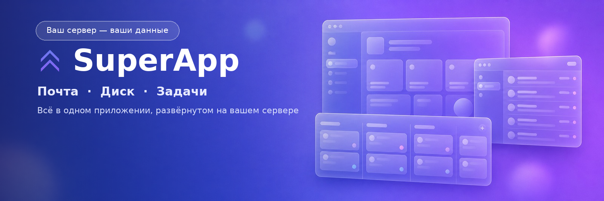
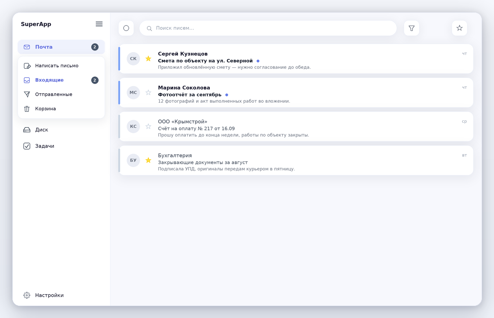
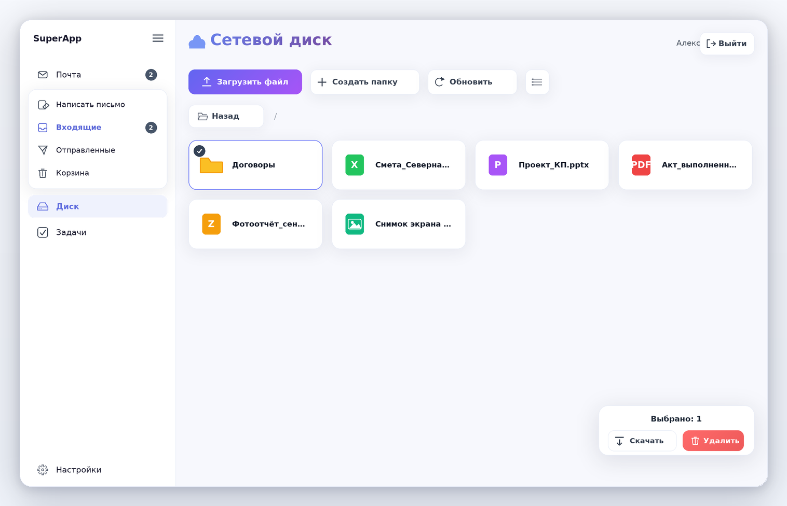
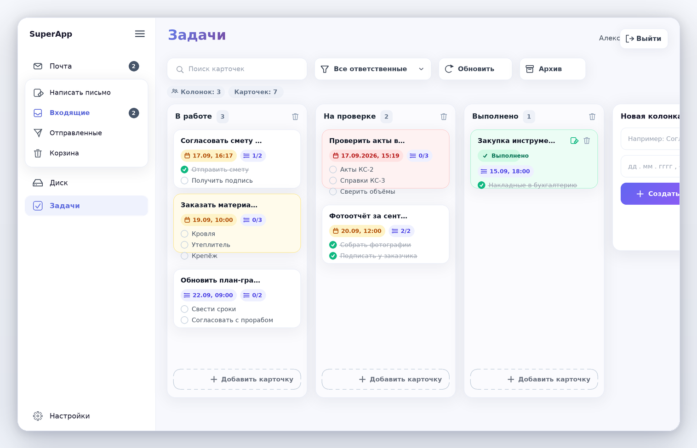
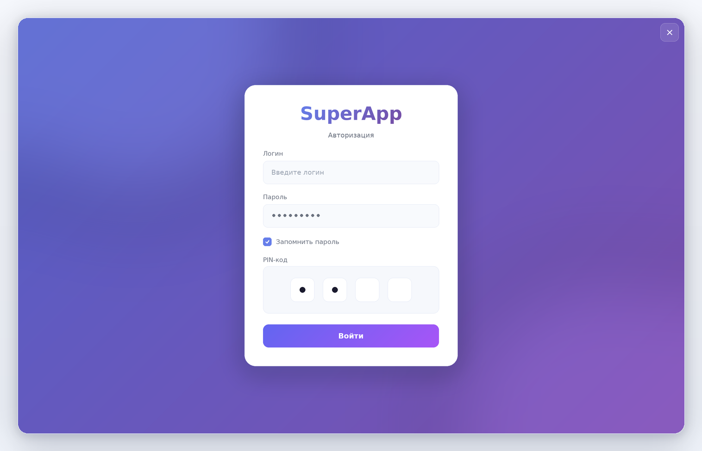
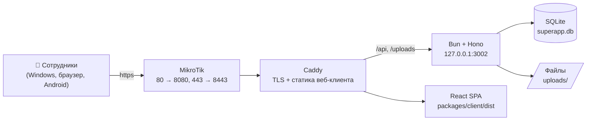

<div align="center">



<h3>Почта · Диск · Задачи — в одном приложении, развёрнутом на вашем сервере</h3>

<p>
  
  
  
  
  
  
</p>

<p>
  <b>Windows 10/11</b> · <b>Windows 7</b> · <b>браузер</b> · <b>Android</b> (в разработке)<br>
  Сервер: Bun + SQLite на Windows, HTTPS через Caddy, домен <code>prostroykrym.ru</code>
</p>

<a href="#что-такое-superapp">Что такое SuperApp</a> ·
<a href="#возможности">Возможности</a> ·
<a href="#быстрый-старт">Быстрый старт</a> ·
<a href="#доступ-из-браузера-и-с-телефона">Доступ с телефона</a> ·
<a href="#архитектура">Архитектура</a> ·
<a href="#данные-бэкапы-и-безопасность">Данные</a> ·
<a href="#частые-вопросы">FAQ</a>

</div>

---

## Что такое SuperApp

**SuperApp** — это внутренняя «рабочая станция» организации: почта, файловый диск
и канбан-задачник, которые работают как одно приложение. Всё это крутится **на вашем
собственном сервере**: данные, файлы и переписка не уходят ни в какие облака —
сервер принадлежит вам, доступ к нему только у ваших сотрудников.

Приложением можно пользоваться четырьмя способами: как обычной программой для
Windows (`.exe`, в том числе на Windows 7), прямо в браузере по HTTPS, с телефона
(Android) или как веб-клиент на планшете.

> **Зачем свой сервер?** Почта и файлы внутри организации, без внешних подписок и
> лимитов, с полным контролем над данными и доступом. Всё, что нужно для работы
> сервера, — один компьютер под Windows и канал в интернет для HTTPS-домена.

---

## Возможности

### ✉️ Почта — внутренняя переписка с вложениями



- Папки «Входящие», «Отправленные», «Корзина»; написать письмо в отдельном окне.
- **Вложения** любых типов — в том числе файлы прямо из модуля «Диск» (не нужно
  скачивать и загружать заново). Все вложения письма можно забрать **одним ZIP-архивом**.
- Автоматическая отметка «прочитано», счётчики непрочитанных, пометка писем
  **звёздочкой**, поиск и фильтры («только непрочитанные», «только избранные»).
- Фоновая проверка новых писем: **уведомление в системном трее Windows** со звуком —
  удобно во время работы в других программах.

### 📁 Диск — файлы и папки с правами доступа



- Файлы и папки: создание, загрузка и скачивание **с индикатором прогресса**,
  переименование, перемещение, удаление; два режима отображения — список и плитка.
- Работа с большими файлами: хранение до **500 МБ** на файл (лимит настраивается
  в `.env`), навигация по папкам с хлебными крошками.
- **Общий доступ к файлам и папкам**: владелец выдаёт доступ конкретным сотрудникам;
  права наследуются вложенными объектами, администратор видит всё.

### ✅ Задачи — канбан-доска команды



- Доски с колонками (создание, переименование, удаление) и карточками,
  свободное **перетаскивание карточек** между колонками и внутри них.
- Исполнители (несколько человек на карточку), фильтр по исполнителю, архив.
- Карточка задачи: описание, **подзадачи** с прогрессом, **комментарии**.
- Всё обновляется на сервере — коллеги видят актуальную доску.

### 🔐 Вход и безопасность



- Вход по логину и паролю + **быстрый вход по 4-значному PIN-коду**
  (bcrypt-хэши паролей и PIN).
- **JWT-токены** с refresh-токеном; в production сервер не запустится без
  заданного `JWT_SECRET`.
- Роли пользователей (администратор / сотрудник); админ-панель: создание
  пользователей, назначение ролей, сброс пароля и PIN.
- Настройки: профиль, аватар, смена пароля и PIN, внешний вид (светлая/тёмная
  тема, акцентные цвета, фон), уведомления.

### 🖥️ Приложение для Windows

- **Собственное окно** (Electron) с заголовком и иконкой, без браузерной обвязки.
- **Иконка в системном трее**: приложение можно свернуть, клик по иконке
  возвращает окно, закрытие окна не выключает уведомления.
- Звуковые уведомления о новых письмах и сообщениях.

---

## Быстрый старт

> Подробная инструкция со всеми тонкостями — в **[`installer/README.md`](installer/README.md)**.
> Ниже — короткий путь для сервера.

**1. Один раз настроить сервер** (Windows 10/11, права администратора, интернет):
установить [Bun](https://bun.sh), скопировать проект и запустить настройку.

```bat
:: 1) Bun (один раз)
powershell -c "irm bun.sh/install.ps1 | iex"

:: 2) Проект — в E:\Server\SuperApp (путь может быть любым)
git clone https://github.com/BORGERone/SuperApp.git E:\Server\SuperApp

:: 3) Настройка и сборка — в оконном установщике:
::    нажмите «Полная установка», затем «Запустить сервер» и «Запустить HTTPS»
E:\Server\SuperApp\installer\SuperApp-Setup.bat
```

**2. Дальше сервер запускается одним двойным кликом** — приложение само поднимет
бэкенд и HTTPS:

```bat
E:\Server\SuperApp\installer\SuperApp-Start.bat
```

Скрипт сам проверит окружение, запустит Bun-сервер и Caddy (HTTPS), дождётся
готовности и будет держать всё в одном окне. Остановка — `Ctrl+C` в этом окне.
Автозапуск при включении компьютера — ярлык в `shell:startup` или задание в
Планировщике (см. `installer/README.md`).

**3. Пользователям** — установить приложение `SuperApp Setup.exe`
(собирается один раз: `build-client.bat`) или просто открыть сайт.

---

## Доступ из браузера и с телефона

Веб-клиент и API отдаются по одному HTTPS-домену (TLS-сертификат Caddy получает
и продлевает сам), поэтому приложением можно пользоваться без установки — в том
числе с телефона или планшета.

<div align="center">

| Откройте на телефоне | Что это даёт |
|---|---|
|  | Наведите камеру телефона — приложение откроется в браузере, **устанавливать ничего не нужно**.<br><br>Вход: логин и пароль, выданные администратором (или быстрый вход по PIN-коду). |

</div>

На этом сервере порты **80/443** заняты другим ПО (1С / `http.sys` / IIS), поэтому
Caddy слушает внутренние **8080/8443**, а роутер MikroTik пробрасывает на них
внешние 80/443 — снаружи адрес остаётся обычным `https://prostroykrym.ru`.

---

## Архитектура



| Слой | Технологии |
|---|---|
| **Сервер** | [Bun](https://bun.sh) · [Hono](https://hono.dev) · SQLite (`bun:sqlite`) · [Drizzle ORM](https://orm.drizzle.team) · JWT · bcrypt |
| **Веб-клиент** | React 19 · TypeScript · Vite · Tailwind CSS · Zustand · TanStack Query · React Router |
| **Desktop** | Electron 22 (Windows 7/10/11) · electron-builder (NSIS-установщик) |
| **Мобильный** | Capacitor (Android) — в разработке |
| **HTTPS / прокси** | Caddy (автоматический Let's Encrypt) |

```text
SuperApp/
├─ packages/
│  ├─ server/          Bun + Hono API: почта, диск, задачи, авторизация
│  │  ├─ src/features/ auth · drive · mail · tasks · user
│  │  ├─ src/db/       SQLite-база superapp.db (живёт только на сервере)
│  │  └─ uploads/      загруженные файлы (только на сервере)
│  └─ client/          React SPA + Electron-обёртка
│     ├─ src/features/ auth · drive · mail · tasks · settings
│     ├─ electron/     главный процесс: окно, трей, уведомления
│     └─ dist/         собранный веб-клиент (отдаёт Caddy)
├─ installer/          всё для развёртывания на Windows (см. ниже)
└─ docs/images/        картинки для этого README
```

**Модули приложения** (`packages/server/src/features`): `auth` — вход, токены,
PIN, роли; `drive` — файлы, папки, права доступа; `mail` — письма, папки,
вложения; `tasks` — колонки, карточки, подзадачи, комментарии; `user` — профиль,
аватар, настройки.

### Что лежит в `installer/`

| Файл | Назначение |
|---|---|
| **`SuperApp-Setup.bat`** | Оконный установщик: `.env`, адрес сервера, `bun install`, сборка веб-клиента, HTTPS, сброс админа |
| **`SuperApp-Start.bat`** | Запуск сервера и HTTPS одним кликом (ключи `/restart`, `/open`, `/diag`, `/help`) |
| **`db-backup.bat`** | Копия живой базы данных и восстановление из копии (`/restore`) |
| `build-client.bat` | Сборка установщика клиента `.exe` (NSIS) с «запечённым» адресом сервера |
| `configure-*.bat`, `setup-*.bat` | Точечные операции: только `.env`, только `config.json`, HTTPS, установка сервера/клиента |

---

## Данные, бэкапы и безопасность

- **Всё ваше и на вашем диске.** База — `packages/server/src/db/superapp.db`,
  файлы — `packages/server/uploads/`. Ничего не отправляется наружу; внешний
  доступ — только через ваш домен и TLS.
- **Секреты не в репозитории.** `.env` (в нём `JWT_SECRET`) и адрес сервера в
  `packages/client/config.json` создаются на месте и в git не попадают.
- **База данных и загруженные файлы не хранятся в git** — иначе каждый `git pull`
  подменял бы базу версией из репозитория. Правила прописаны в `.gitignore`.
- **Бэкап в один клик:** `installer\db-backup.bat` складывает копию базы в
  `installer\backups\` (этот каталог локальный и тоже не попадает в git).
  Порядок безопасного обновления сервера — в `installer/README.md`.
- **Права:** доступ к файлам выдаётся поштучно и наследуется вложенными папками,
  администратор видит всё; пароли и PIN хранятся в виде bcrypt-хэшей.

---

## Частые вопросы

<details>
<summary><b>Где хранится база данных и можно ли её выключить из git?</b></summary>

База — файл `packages/server/src/db/superapp.db` рядом с кодом сервера. В этой
ветке он **не отслеживается git** и закрыт правилами `.gitignore`. Если в какой-то
ветке база всё ещё в индексе (`git ls-files packages/server/src/db` показывает
`superapp.db`) — закройте вопрос один раз: сделайте копию
(`installer\db-backup.bat`) и выполните
`git rm --cached packages/server/src/db/superapp.db` с коммитом. Файл останется на
диске, но перестанет «сбрасываться» при `git pull`. Подробнее — в
[`installer/README.md`](installer/README.md), раздел «База данных, загрузки и git».
</details>

<details>
<summary><b>Как обновлять сервер и не потерять данные?</b></summary>

```bat
:: Ctrl+C в окне SuperApp-Start (остановить сервер)
cd /d E:\Server\SuperApp
installer\db-backup.bat      :: копия базы
git pull
installer\db-backup.bat /restore   :: только если pull всё-таки задел базу
installer\SuperApp-Start.bat       :: запустить сервер
```
</details>

<details>
<summary><b>Сервер запускается сам после перезагрузки?</b></summary>

Да — положите ярлык на `SuperApp-Start.bat` в автозагрузку (`Win+R` → `shell:startup`)
или создайте задание в Планировщике Windows с триггером «При запуске компьютера»
(пример в `installer/README.md`). Так сервер и HTTPS поднимутся без входа в систему.
</details>

<details>
<summary><b>Забыт пароль или PIN администратора</b></summary>

В оконном установщике `SuperApp-Setup.bat` есть блок «Сброс пароля и PIN админа»
(по умолчанию `admin` / `admin123` / PIN `1234`). Из командной строки то же делает
`installer\reset-admin.bat [логин] [пароль] [pin]`.
</details>

<details>
<summary><b>Нужен ли интернет для работы приложения?</b></summary>

Внутри сети — не нужен: клиенты обращаются к вашему серверу, а он самодостаточен.
Интернет нужен только для доступа снаружи по домену (и для выпуска TLS-сертификата
Caddy при первом запуске).
</details>

<details>
<summary><b>Как подключить клиента к серверу вручную?</b></summary>

Адрес сервера задаётся в `packages/client/config.json` рядом с `SuperApp.exe`
(или в `%APPDATA%\SuperApp\config.json`), переменной окружения `SUPERAPP_API_URL`,
либо был «запечён» при сборке `.exe`. После изменения — перезапустить приложение.
</details>

---

## Разработка

```bat
:: зависимости
bun install

:: сервер (http://127.0.0.1:3002) и клиент с горячей перезагрузкой
bun run dev:server
bun run dev            :: Vite dev-сервер клиента

:: всё сразу, как у пользователя
dev.bat                :: сервер + Electron-клиент
```

- `packages/server` — API на Hono: маршруты в `src/features/*/routes`, работа с БД
  через Drizzle (`bun run db:push`, `db:studio`).
- `packages/client` — React SPA: модули в `src/features`, стор на Zustand,
  запросы на TanStack Query; Electron-специфика в `packages/client/electron`.
- Архитектурные заметки и планы — в [`AI_GUIDE.md`](AI_GUIDE.md).

---

<div align="center">
<sub>
Иллюстрации интерфейса в этом README — макеты, нарисованные для документации по реальному клиенту;<br>
данные на них вымышленные. Настоящий скриншот можно подставить, сохранив имена файлов в <code>docs/images/</code>.<br>
Проект внутренний: развёртывание, данные и доступ — на вашем сервере.
</sub>
</div>
